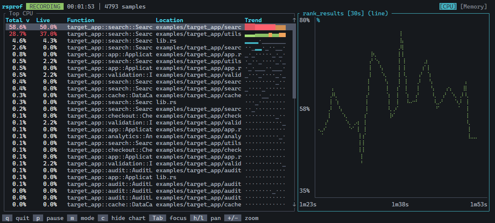
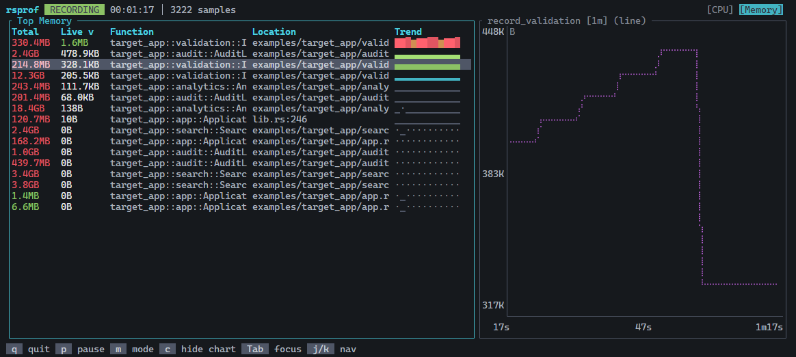

# rsprof

A zero-instrumentation profiler for Rust applications with real-time CPU and heap analysis.

## Screenshots

### CPU



### Heap



## Features

- **CPU profiling** - Timer-based sampling via perf events or self-instrumentation
- **Heap profiling** - Track allocations, deallocations, and live memory
- **Interactive TUI** - Real-time charts and tables with vim-style navigation
- **SQLite storage** - Query profiles with SQL, export to JSON/CSV
- **Symbol resolution** - Full DWARF debug info support

## Quick Start

### 1. Add rsprof-trace to your application

```toml
[dependencies]
rsprof-trace = { version = "0.1", features = ["profiling"] }
```

### 2. Instrument your code

```rust
// One line enables CPU + heap profiling
rsprof_trace::profiler!();

fn main() {
    // Your application code...
}
```

Or customize the CPU sampling frequency:

```rust
rsprof_trace::profiler!(cpu = 199);  // 199Hz instead of default 99Hz
```

### 3. Build with frame pointers

Frame pointers are required for accurate stack traces:

```bash
RUSTFLAGS="-C force-frame-pointers=yes" cargo build --release
```

### 4. Run the profiler

```bash
# Start your application
./target/release/your_app &

# Attach the profiler
rsprof -p $(pgrep your_app)
```

## Installation

```bash
cargo install rsprof
```

Or build from source:

```bash
git clone https://github.com/vibesrc/rsprof
cd rsprof
cargo install --path crates/rsprof
```

## Usage

### Live Profiling

```bash
# Profile by PID
rsprof -p 1234

# Profile by process name
rsprof -P my_app

# Save to specific file
rsprof -p 1234 -o profile.db

# Record for 30 seconds
rsprof -p 1234 -d 30s

# Quiet mode (no TUI, just record)
rsprof -p 1234 -q -d 10s
```

### Viewing Saved Profiles

```bash
# Interactive TUI viewer
rsprof view profile.db

# View most recent profile
rsprof view

# List available profiles
rsprof list
```

### CLI Analysis

```bash
# Top CPU consumers
rsprof top cpu profile.db

# Top memory consumers
rsprof top heap profile.db

# With options
rsprof top cpu profile.db -n 50 --threshold 1.0 --json

# Raw SQL queries
rsprof query profile.db "SELECT * FROM cpu_samples LIMIT 10"
```

## TUI Controls

| Key           | Action                      |
| ------------- | --------------------------- |
| `q` / `Esc`   | Quit                        |
| `1` / `2`     | Switch to CPU / Memory view |
| `m`           | Toggle view mode            |
| `c` / `Enter` | Toggle chart visibility     |
| `j` / `k`     | Navigate table (down/up)    |
| `h` / `l`     | Pan chart (left/right)      |
| `+` / `-`     | Zoom chart (in/out)         |
| `Tab`         | Switch focus (table/chart)  |
| `p`           | Pause/resume (live mode)    |

## rsprof-trace Features

The `rsprof-trace` crate supports conditional compilation:

```toml
# Profiling enabled (CPU + Heap)
rsprof-trace = { version = "0.1", features = ["profiling"] }

# Disabled (zero-cost passthrough)
rsprof-trace = { version = "0.1" }
```

When no features are enabled, `profiler!()` expands to nothing and has zero overhead. This lets you keep the instrumentation in your code and toggle profiling at build time:

```bash
# Production build - no profiling
cargo build --release

# Profiling build
cargo build --release --features profiling
```

## Memory Profiling

Memory profiling tracks every allocation and deallocation in your application, letting you identify:

- **Memory leaks** - Allocations that are never freed
- **High-churn allocations** - Functions that allocate/free frequently
- **Large allocations** - Where your memory is going
- **Live memory by call site** - What's holding memory right now

### What's Tracked

| Metric          | Description                                 |
| --------------- | ------------------------------------------- |
| Live bytes      | Currently allocated memory (allocs - frees) |
| Total allocated | Cumulative bytes allocated                  |
| Total freed     | Cumulative bytes freed                      |
| Alloc count     | Number of allocation calls                  |
| Free count      | Number of deallocation calls                |

### Memory View

Press `2` or `m` in the TUI to switch to memory view. The table shows:

```
Live     Trend      Function                    Location
1.2MB    ▂▃▅▇█▇▅   run_large_query             src/main.rs:42
256KB    ▁▁▂▂▃▃▄   create_session_data         src/cache.rs:87
...
```

- **Live** - Current live bytes at this call site
- **Trend** - Sparkline showing memory over time
- **Function** - The allocation site (first user frame, not allocator internals)

### Finding Memory Leaks

Look for call sites where:

- Live bytes keep growing over time (upward sparkline trend)
- Alloc count >> Free count

```bash
# Query for potential leaks
rsprof query profile.db "
  SELECT function, file, line,
         total_alloc_bytes - total_free_bytes as leaked,
         total_allocs - total_frees as leaked_count
  FROM heap_samples
  WHERE total_allocs > total_frees
  ORDER BY leaked DESC
  LIMIT 20
"
```

## How It Works

1. **rsprof-trace** writes profiling events to a shared memory ring buffer
2. **rsprof** attaches to the process and reads events from shared memory
3. Stack traces are captured using frame pointers for minimal overhead
4. Data is stored in SQLite for persistence and queryability

## Requirements

- Linux (uses perf events and shared memory)
- Rust nightly (uses `let_chains` feature)
- Frame pointers enabled for accurate stack traces

## License

MIT
